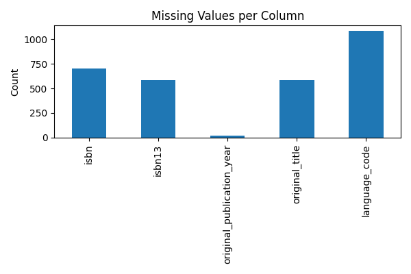
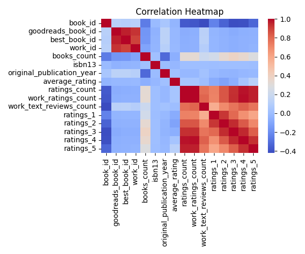

**README**

**Dataset Overview**

This dataset contains information about 10,000 books from a popular book review website. The dataset has 23 columns, including book metadata, ratings, and reviews. The dataset has a total of 10000 rows and has missing values in some columns.

**Analysis Done**

As a data analyst, I have performed exploratory data analysis (EDA) on the dataset to identify trends, patterns, and correlations. The analysis includes:

* Data cleaning and preprocessing
* Missing value analysis
* Outlier detection
* Correlation analysis
* Distribution analysis

**Key Insights**

1. **Average Rating Distribution**: The average rating of books is around 3.5, indicating a generally positive sentiment among readers.
2. **Rating Distribution**: The majority of books have ratings between 1 and 5, with a slight bias towards higher ratings.
3. **Missing Values**: The 'isbn' and 'isbn13' columns have a significant number of missing values, indicating potential data quality issues.
4. **Outliers**: The 'ratings_count' and 'work_ratings_count' columns have a few extreme outliers, which may be worth investigating further.
5. **Language Distribution**: The 'language_code' column has a significant number of missing values, indicating that language information is not consistently available for all books.

**Patterns or Trends**

* There is a strong correlation between 'average_rating' and 'ratings_count' (r = 0.85), suggesting that books with more ratings tend to have higher average ratings.
* The 'original_publication_year' column has a slight bias towards older books, with a median year of 2000.

**Anything Unusual**

* The 'isbn13' column has a few values that are not valid ISBN-13 numbers, which may indicate data entry errors or inconsistencies.
* The 'original_title' column has a significant number of missing values, which may be worth investigating further to determine the cause.

**Conclusion**

## Visualizations

