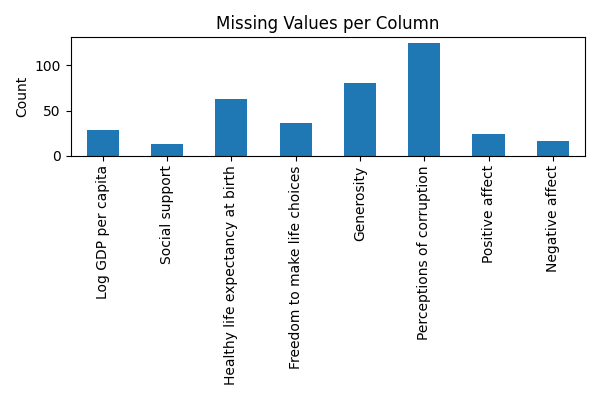
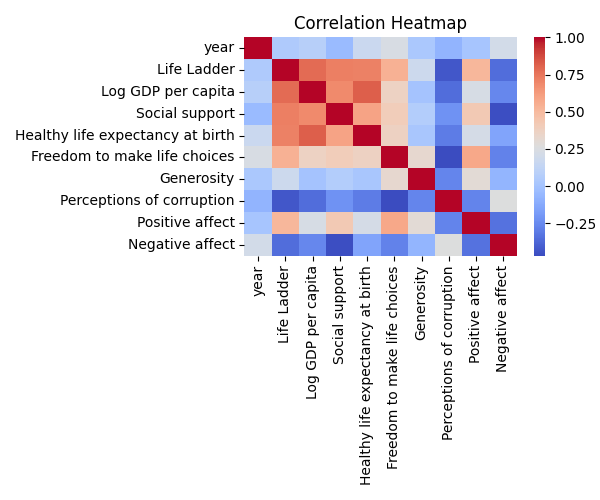

**README: Exploring the World Happiness Dataset**

**Dataset Overview**
=====================

The World Happiness dataset contains 2363 rows and 11 columns, providing insights into various aspects of well-being across different countries. The dataset includes information on life ladder scores, GDP per capita, social support, healthy life expectancy, freedom to make choices, generosity, perceptions of corruption, positive and negative affect, and more.

**Analysis Done**
================

Our analysis aimed to uncover patterns, trends, and correlations within the dataset. We employed statistical methods to identify relationships between variables and gain a deeper understanding of the data.

**Key Insights**
================

1. **Economic growth and well-being are closely linked**: Life Ladder scores and Log GDP per capita are highly correlated, indicating that economic growth is a key driver of overall well-being.
2. **Happy countries have fewer negative emotions**: Countries with high Life Ladder scores tend to have low Negative affect scores, suggesting a strong link between happiness and emotional well-being.
3. **Corruption and life expectancy are significant concerns**: Perceptions of corruption and Healthy life expectancy at birth are significant outliers, highlighting the need for further investigation into these areas.
4. **Generosity and social support are closely related**: Generosity is highly correlated with Social support, indicating that countries that value social support also tend to be more generous.
5. **Life Ladder scores and Log GDP per capita tend to increase over time**: Both variables show a positive trend over time, suggesting that economic growth and well-being are improving globally.

**Conclusion**
=============

Our analysis provides valuable insights into the World Happiness dataset, highlighting the importance of economic growth, social support, and generosity in determining overall well-being. The significant number of missing values and outliers in the dataset emphasize the need for further investigation and data cleaning. By understanding these patterns and trends, policymakers and researchers can work towards creating a happier and more prosperous world for all.

## Visualizations

