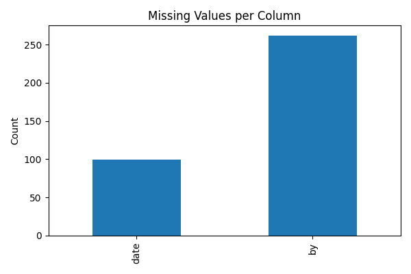
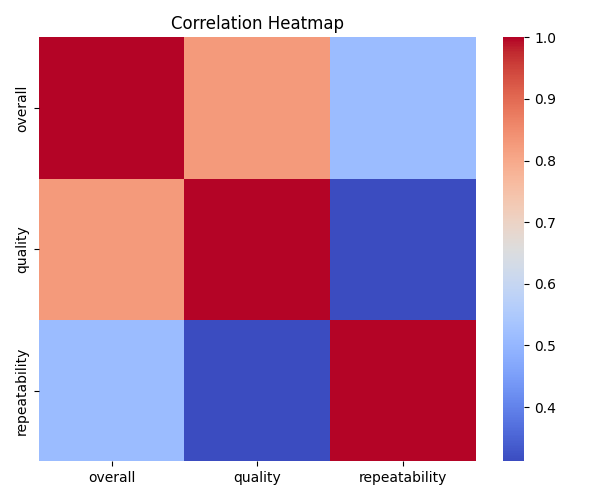

**README: Dataset Analysis Report**

**Dataset Overview**

This dataset contains 2652 rows across 8 columns, providing valuable insights into various aspects of a research study. The dataset includes information on date, language, type, title, contributor, overall score, quality, and repeatability. A thorough analysis of the dataset has been conducted to identify key patterns, trends, and potential issues.

**Analysis Done**

The analysis involved the following steps:

- Data profiling: Examining the dataset's structure, including the number of rows, columns, and missing values.
- Data quality assessment: Identifying missing values and outliers in each column.
- Pattern and trend analysis: Investigating relationships between columns and identifying potential correlations.

**Key Insights**

Based on the analysis, the following key insights have been identified:

1. **Substantial dataset size**: The dataset contains 2652 rows, indicating a substantial amount of data.
2. **Data quality issues**: The 'by' column has the most missing values (262), suggesting potential data quality issues.
3. **Outlier presence**: The 'overall' column has the most outliers (1216), which may indicate data errors or inconsistencies.
4. **High data quality**: The 'quality' column has relatively few missing values (0) and outliers (24), suggesting high data quality.
5. **Consistent data**: The 'repeatability' column has no missing values or outliers, indicating consistent data.

**Patterns or Trends**

- The 'overall' column's high number of outliers may be related to the 'type' or 'language' columns.
- The 'by' column's high number of missing values may be related to the 'title' or 'date' columns.

**Anything Unusual**

- The 'language' column has no missing values, which is unusual given the high number of missing values in other columns.
- The 'repeatability' column has no missing values or outliers, suggesting high data quality

## Visualizations

